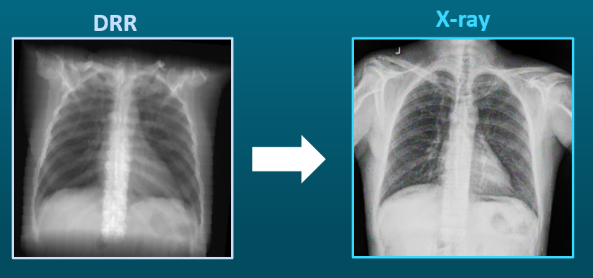

# Image-to-image transfer between Xray and DRR

## Who are we?

Hello! We are Rotem and Gilli, students at the Electrical & Computer Engineering faculty of the Technion Israel Institute of Technology.
This is our final project in the CGM Technion Lab, supervised by Ori Nizan.

## Introduction

This project aims to successfully transfer image-to-image between various domains: Xray images, Digitally Reconstructed Radiograph (DRR), Bones Images, and Lungs images. The 2D DRR, bones, and lung images were created from 3D CT imaging.

In this project, we investigate the following image-to-image transfers:

1. Xray --> DRR
2. DRR --> Xray
3. DRR --> Bones image
4. DRR --> Lungs image
5. Xray --> Bones image
6. Xray -> Lungs image

We chose to use the cycleGAN and pix2pix models for these assignments. This code is mainly taken from theirs, with minor changes to the model architecture.
You can find the cycleGAN and pix2pix code, with information on how to run it, in the following link: https://github.com/junyanz/pytorch-CycleGAN-and-pix2pix.
In order to activate our changes to the model, add to your CycleGAN training the following parameter: `--discriminator_type new`. What it does is explained under the "Xray -> DRR" section.

## Links to our organized folders

Our model's 
[checkpoints](https://drive.google.com/drive/folders/1PSRrbg0OcSF3qIfkiapvns4LwdJ0xSOs?usp=sharing),
our 
[results](https://drive.google.com/drive/folders/1TnKYJ8oe-hJk1heF0PuzV_p5iUZiOmQC?usp=sharing),
and our 
[data](https://drive.google.com/drive/folders/10YdnX1XX2C--PVAQo-iqZPlj-JH_R9ie?usp=sharing)

## Dataset

We used the dataset of the DecGAN model. You can find the model and its dataset here: https://github.com/ZerojumpLine/DecGAN

## Xray -> DRR

We tried two different models for these assignments:
1. CycleGAN model
2. CycleGAN+EAD model: To improve the previous results, we changed Discriminator A (our DRR discriminator) to Edge Aware Discriminator (EAD). If you want to activate it, add to your CycleGAN training the following parameter: `--discriminator_type new`.

Here is EAD architure:

We added one channel to the original discriminator input channels: 2D grayscale edge image of the original image, created using Difference of Gaussian filter (DoG).
  
results:

## DRR -> Xray

We tried two different models for these assiments:
  1. CycleGAN model
  2. pix2pix model, on pairs of Xray and DRR images created with the CycleGAN+EAD model (Xray--> DRR direction).

results:

1.

2.

## DRR -> Bones and DRR -> Lungs

We used pix2pix for these assignments.
  
results:

## Xray -> Bones and Xray -> Lungs

This assignment can be achieved using an inbetween domain: the DRR image domain.

First, we used the CycleGAN+EAD model to transfer the Xray domain to the DRR domain. Then, we used pix2pix to transfer from the DRR domain to the bones image domain or the lungs image domain.

## Evaluate results codes
We used Matlab codes to make diff images to better understand our results. These codes can be found under the `visual_evaluation_code` folder.
In order to run the script `projectA_results_code`, you must [download](https://drive.google.com/drive/folders/1BtN4qs6c5QY8cKbbn0syeqhozMMR0fva?usp=sharing) a folder named `results`, containing images for display, and save it in the same directory as the codes. Besides the script `projectA_results_code`, the folder contains the script's helper functions.

## Our project's poster

